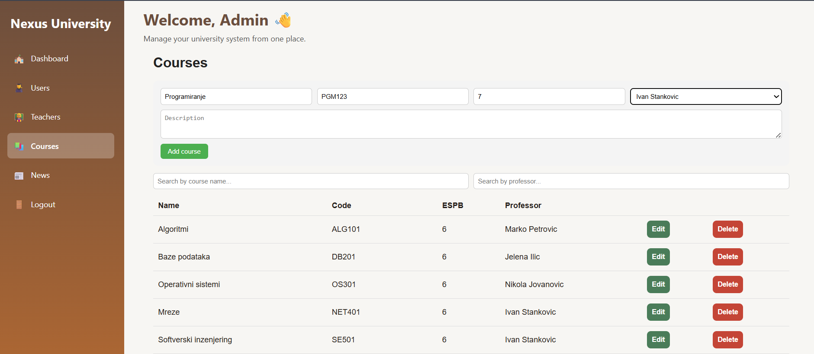
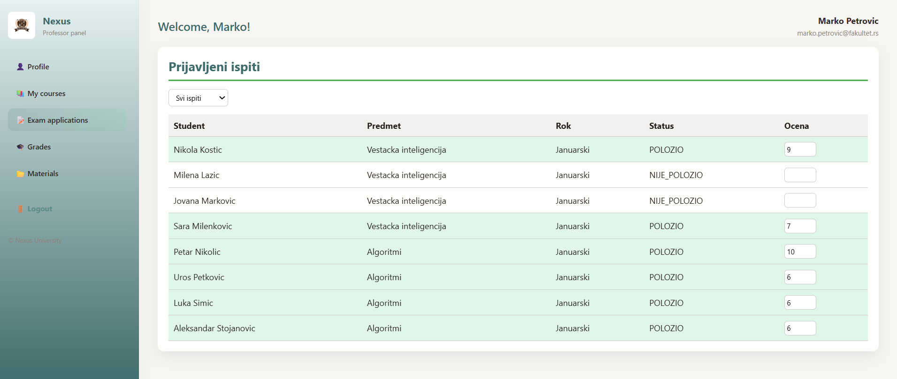
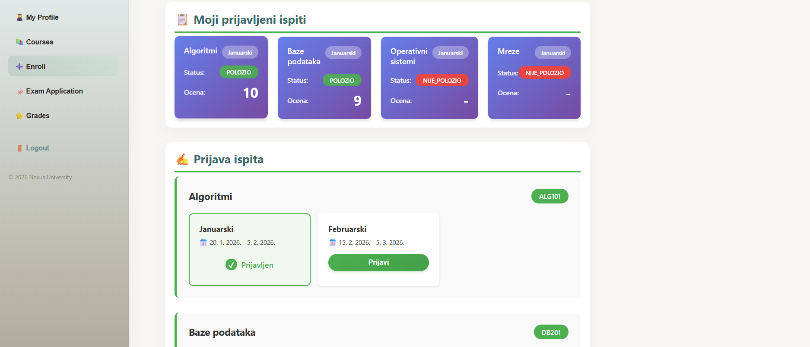
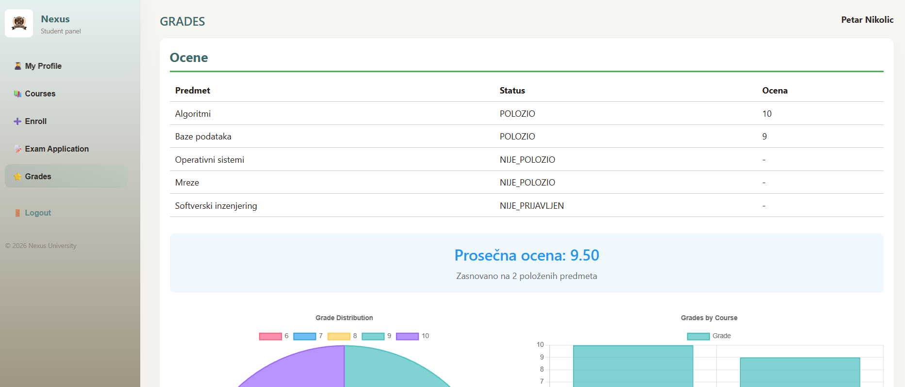

# 🎓 Nexus - University Management System

<div align="center">
  
  
  A full-stack web application for managing university operations, built with Node.js, React, and SQLite. This system provides role-based access for administrators, professors, and students to manage courses, enrollments, exams, and grades.

  
  
  
  
</div>

---

## 📋 Table of Contents

- [Features](#-features)
- [Tech Stack](#-tech-stack)
- [Project Structure](#-project-structure)
- [Installation](#-installation)
- [Database Setup](#-database-setup)
- [Usage](#-usage)
- [Screenshots](#-screenshots)
- [API Endpoints](#-api-endpoints)
- [User Roles](#-user-roles)
- [Contributing](#-contributing)
- [License](#-license)

## ✨ Features

### 👨‍💼 Administrator
- ✅ Manage users (students, professors, admins)
- ✅ Create and manage courses
- ✅ Assign professors to courses
- ✅ Set up exam periods and schedules
- ✅ Post system-wide announcements
- ✅ View comprehensive statistics

### 👨‍🏫 Professor
- ✅ View assigned courses
- ✅ Upload course materials (PDFs, documents)
- ✅ Track enrolled students
- ✅ Manage exams and applications
- ✅ Enter grades for exams
- ✅ Post course announcements

### 👨‍🎓 Student
- ✅ Browse available courses
- ✅ Enroll in courses
- ✅ Apply for exams during active periods
- ✅ View grades and academic records
- ✅ Download course materials
- ✅ Update personal profile

## 🛠 Tech Stack

### Backend
- **Node.js** - Runtime environment
- **Express.js** - Web framework
- **SQLite3** - Database
- **Sequelize** - ORM (Object-Relational Mapping)
- **JWT** - Authentication tokens
- **bcrypt** - Password hashing
- **multer** - File upload handling
- **cors** - Cross-origin resource sharing
- **dotenv** - Environment configuration

### Frontend
- **React 18** - UI library
- **React Router v6** - Client-side routing
- **Axios** - HTTP client
- **Tailwind CSS** - Utility-first CSS framework
- **Vite** - Build tool and dev server
- **Context API** - State management

### Development Tools
- **nodemon** - Auto-restart server
- **ESLint** - Code linting
- **Prettier** - Code formatting

## 📁 Project Structure

```
Nexus/
├── backend/                        # Backend server
│   ├── package.json               # Node.js dependencies
│   └── src/                       # Source code
│       ├── config/                # Server & database config
│       │   ├── db.config.js       # Database configuration
│       │   └── index.js           # Main config
│       │
│       ├── controllers/           # Request handlers
│       │   ├── users.controller.js
│       │   ├── courses.controller.js
│       │   ├── exams.controller.js
│       │   └── grades.controller.js
│       │
│       ├── database/              # Database logic
│       │   ├── connection.js      # DB connection
│       │   └── models/            # Data models
│       │       ├── user.model.js
│       │       ├── course.model.js
│       │       ├── enrollment.model.js
│       │       ├── exam.model.js
│       │       ├── grade.model.js
│       │       └── material.model.js
│       │
│       ├── middlewares/           # Middleware functions
│       │   ├── auth.middleware.js # Authentication
│       │   ├── role.middleware.js # Role-based access
│       │   └── error.middleware.js
│       │
│       ├── routes/                # API routes
│       │   ├── users.routes.js
│       │   ├── courses.routes.js
│       │   ├── exams.routes.js
│       │   ├── admin.routes.js
│       │   ├── professor.routes.js
│       │   ├── student.routes.js
│       │   └── index.js           # Route aggregator
│       │
│       ├── seed/                  # Database seeding
│       │   └── initial.seed.js
│       │
│       ├── services/              # Business logic
│       │   ├── user.service.js
│       │   ├── course.service.js
│       │   ├── exam.service.js
│       │   └── grade.service.js
│       │
│       └── utils/                 # Helper functions
│           ├── helpers.js
│           └── validators.js
│
├── frontend/                      # Frontend React app
│   ├── package.json               # Frontend dependencies
│   ├── public/                    # Static files
│   │   ├── index.html
│   │   ├── favicon.ico
│   │   ├── manifest.json
│   │   ├── images/                # Images & logos
│   │   └── videos/                # Video content
│   │
│   └── src/                      # Source code
│       ├── App.js                # Main React component
│       ├── index.js              # Entry point
│       │
│       ├── api/                  # API integration
│       │   ├── axios.js          # Axios config
│       │   ├── auth.api.js
│       │   ├── users.api.js
│       │   ├── courses.api.js
│       │   └── exams.api.js
│       │
│       ├── auth/                 # Authentication
│       │   ├── AuthContext.jsx   # Auth context
│       │   ├── ProtectedRoute.jsx
│       │   └── RequireRole.jsx
│       │
│       ├── layouts/              # Layout components
│       │   ├── PublicLayout.jsx
│       │   ├── AdminLayout.jsx
│       │   ├── ProfessorLayout.jsx
│       │   └── StudentLayout.jsx
│       │
│       ├── pages/                # Page components
│       │   ├── Admin/
│       │   │   ├── AdminDashboard.jsx
│       │   │   ├── Courses.jsx
│       │   │   ├── Users.jsx
│       │   │   ├── Teachers.jsx
│       │   │   └── Announcements.jsx
│       │   │
│       │   ├── Professor/
│       │   │   ├── TeacherDashboard.jsx
│       │   │   └── components/
│       │   │       ├── CourseStudents.jsx
│       │   │       ├── Exams.jsx
│       │   │       └── Grades.jsx
│       │   │
│       │   ├── Public/
│       │   │   ├── HomePage.jsx
│       │   │   ├── LoginPage.jsx
│       │   │   └── ForgotPassword.jsx
│       │   │
│       │   └── Student/
│       │       ├── StudentDashboard.jsx
│       │       └── components/
│       │           ├── MyCourses.jsx
│       │           ├── MyExams.jsx
│       │           ├── StudentProfile.jsx
│       │           └── AvailableCourses.jsx
│       │
│       ├── services/            # Frontend services
│       │   ├── api.js
│       │   └── user.service.js
│       │
│       └── styles/
│           └── global.css       # Global styles
│
├── images/                       # Project images & screenshots
│   ├── logo.png
│   ├── logo-dark.png
│   └── screenshots/
│       ├── login.png
│       ├── admin-dashboard.png
│       ├── professor-panel.png
│       └── student-panel.png
│
├── .gitignore
├── .env.example
└── README.md
```

## 🚀 Installation

### Prerequisites
- **Node.js** (v14 or higher)
- **npm** or **yarn**
- **Git**

### Clone the repository
```bash
git clone https://github.com/darelony/sajt.git
cd fakultet
```

### Install Backend Dependencies
```bash
cd backend
npm install
```

### Install Frontend Dependencies
```bash
cd ../frontend
npm install
cd ..
```

### Environment Variables

Create `.env` file in the **backend** directory:

```env
# Server Configuration
PORT=5000
NODE_ENV=development

# Database
DB_PATH=./database.sqlite

# JWT Secret
JWT_SECRET=your_super_secret_jwt_key_change_this_in_production
JWT_EXPIRE=7d

# CORS
FRONTEND_URL=http://localhost:3000

# File Upload
MAX_FILE_SIZE=5242880
UPLOAD_PATH=./uploads
```

## 💾 Database Setup

### 1. Navigate to backend
```bash
cd backend
```

### 2. Sync database (create tables)
```bash
node src/database/connection.js
# or if you have a sync script
npm run db:sync
```

### 3. Seed database with sample data
```bash
node src/seed/initial.seed.js
# or
npm run db:seed
```

This will create:
- **1 Administrator**
- **10 Professors**
- **75 Students**
- **20 Courses**
- **4 Exam Periods**
- **Random course enrollments**

### Default Login Credentials

```
📌 Administrator:
Email: admin@nexus.com
Password: admin123

📌 Professor (1-10):
Email: profesor1@nexus.com - profesor10@nexus.com
Password: password123

📌 Student (1-75):
Email: student1@nexus.com - student75@nexus.com
Password: password123
```

## 🎯 Usage

### Start Backend Server
```bash
cd backend
npm start
# or for development with auto-reload
npm run dev
```
Backend runs on: `http://localhost:5000`

### Start Frontend (new terminal)
```bash
cd frontend
npm run dev
```
Frontend runs on: `http://localhost:3000`

### Access the Application
Open your browser and navigate to: **`http://localhost:3000`**

## 📸 Screenshots

### Login Page


### Admin Dashboard


### Professor Panel


### Student Exams Panel


### Student Grades Panel



## 📡 API Endpoints

### Authentication
```http
POST   /api/auth/login          # User login
POST   /api/auth/register       # User registration
GET    /api/auth/me             # Get current user
POST   /api/auth/logout         # User logout
```

### Admin Routes (Requires admin role)
```http
GET    /api/admin/users              # Get all users
POST   /api/admin/users              # Create new user
PUT    /api/admin/users/:id          # Update user
DELETE /api/admin/users/:id          # Delete user
GET    /api/admin/courses            # Get all courses
POST   /api/admin/courses            # Create course
PUT    /api/admin/courses/:id        # Update course
DELETE /api/admin/courses/:id        # Delete course
GET    /api/admin/exam-periods       # Get exam periods
POST   /api/admin/exam-periods       # Create exam period
PUT    /api/admin/exam-periods/:id   # Update exam period
DELETE /api/admin/exam-periods/:id   # Delete exam period
GET    /api/admin/statistics         # Get system statistics
POST   /api/admin/announcements      # Create announcement
```

### Professor Routes (Requires profesor role)
```http
GET    /api/professor/courses              # Get professor's courses
GET    /api/professor/students/:courseId   # Get enrolled students
GET    /api/professor/materials/:courseId  # Get course materials
POST   /api/professor/materials            # Upload material
DELETE /api/professor/materials/:id        # Delete material
GET    /api/professor/exam-applications    # Get exam applications
GET    /api/professor/exams/:courseId      # Get exams for course
POST   /api/professor/exams                # Create exam
POST   /api/professor/grades               # Enter grade
PUT    /api/professor/grades/:id           # Update grade
POST   /api/professor/announcements        # Post announcement
```

### Student Routes (Requires student role)
```http
GET    /api/student/profile                # Get student profile
PUT    /api/student/profile                # Update profile
GET    /api/student/courses                # Get available courses
GET    /api/student/enrolled               # Get enrolled courses
POST   /api/student/enroll                 # Enroll in course
DELETE /api/student/enroll/:id             # Unenroll from course
GET    /api/student/materials/:courseId    # Get course materials
GET    /api/student/exam-periods           # Get active exam periods
POST   /api/student/apply-exam             # Apply for exam
GET    /api/student/exam-applications      # Get my applications
GET    /api/student/grades                 # Get my grades
GET    /api/student/announcements          # Get announcements
```

## 👥 User Roles & Permissions

### 🔴 Administrator (admin)
Full system access including:
- User management (CRUD operations)
- Course management
- Professor-course assignments
- Exam period configuration
- System-wide announcements
- Statistics and reports

### 🔵 Professor (profesor)
Course management capabilities:
- View assigned courses
- Manage course materials
- View enrolled students
- Create and manage exams
- Enter and update grades
- Post course announcements

### 🟢 Student (student)
Learning platform access:
- Browse and enroll in courses
- Apply for exams
- View grades and transcripts
- Download course materials
- Update personal profile
- View announcements

## 🗄️ Database Schema

### Core Tables

#### users
Stores all system users (admin, professors, students)
- `user_id` (PK)
- `ime`, `prezime`, `email`, `lozinka`
- `uloga` (admin | profesor | student)
- `indeks`, `smer`, `godina` (for students)
- `adresa`, `telefon`, `profilna_slika`
- `created_at`, `updated_at`

#### courses
Course information
- `course_id` (PK)
- `naziv`, `sifra`, `espb`, `opis`
- `profesor_id` (FK → users)
- `created_at`

#### enrollments
Student-course relationships (M:N)
- `enrollment_id` (PK)
- `student_id` (FK → users)
- `course_id` (FK → courses)
- `enrolled_at`

#### exam_periods
Exam session dates
- `period_id` (PK)
- `naziv`, `datum_od`, `datum_do`
- `aktivan` (boolean)
- `created_at`

#### exam_applications
Student exam registrations
- `application_id` (PK)
- `student_id` (FK → users)
- `course_id` (FK → courses)
- `period_id` (FK → exam_periods)
- `status` (prijavljen | položio | nije položio)
- `applied_at`

#### grades
Student grades
- `grade_id` (PK)
- `student_id` (FK → users)
- `course_id` (FK → courses)
- `ocena` (5-10)
- `datum`
- `application_id` (FK → exam_applications)
- `created_at`

#### materials
Course materials
- `material_id` (PK)
- `course_id` (FK → courses)
- `naslov`, `opis`
- `fajl_putanja`
- `uploaded_at`

#### announcements
System announcements
- `announcement_id` (PK)
- `naslov`, `tekst`
- `autor_id` (FK → users)
- `datum`

## 🔒 Security Features

- **JWT Authentication** - Secure token-based authentication
- **Password Hashing** - bcrypt with salt rounds
- **Role-based Access Control** - Middleware authorization
- **Input Validation** - Server-side validation
- **SQL Injection Protection** - Sequelize ORM parameterized queries
- **CORS Configuration** - Controlled cross-origin requests
- **Environment Variables** - Sensitive data protection

## 🧪 Testing

### Backend API Testing
Use **Postman**, **Thunder Client**, or **curl**:

```bash
# Login
curl -X POST http://localhost:5000/api/auth/login \
  -H "Content-Type: application/json" \
  -d '{"email":"admin@nexus.com","password":"password123"}'

# Get users (requires admin token)
curl -X GET http://localhost:5000/api/admin/users \
  -H "Authorization: Bearer YOUR_JWT_TOKEN"
```

## 📝 Available Scripts

### Backend Scripts
```json
{
  "start": "node src/index.js",
  "dev": "nodemon src/index.js",
  "db:sync": "node src/database/connection.js",
  "db:seed": "node src/seed/initial.seed.js",
  "db:reset": "npm run db:sync && npm run db:seed"
}
```

### Frontend Scripts
```json
{
  "dev": "vite",
  "build": "vite build",
  "preview": "vite preview",
  "lint": "eslint src --ext js,jsx"
}
```

## 🚀 Deployment

### Backend Deployment (Heroku example)
```bash
cd backend
heroku create nexus-backend
git push heroku main
heroku config:set JWT_SECRET=your_secret
```

### Frontend Deployment (Vercel example)
```bash
cd frontend
vercel --prod
```

## 🤝 Contributing

Contributions are welcome! Please follow these steps:

1. Fork the repository
2. Create a feature branch (`git checkout -b feature/AmazingFeature`)
3. Commit your changes (`git commit -m 'Add some AmazingFeature'`)
4. Push to the branch (`git push origin feature/AmazingFeature`)
5. Open a Pull Request

### Code Style Guidelines
- Use **ES6+** features
- Follow **Airbnb JavaScript Style Guide**
- Write meaningful commit messages
- Add comments for complex logic
- Keep functions small and focused

## 🐛 Known Issues

- [ ] File upload size limit notification
- [ ] Bulk grade import feature
- [ ] Email notifications for exam results
- [ ] Mobile responsiveness improvements

## 📈 Future Enhancements

- [ ] Real-time notifications (Socket.io)
- [ ] Calendar integration
- [ ] Advanced analytics dashboard
- [ ] Mobile application (React Native)
- [ ] Multi-language support (i18n)
- [ ] Dark mode toggle
- [ ] Export reports to PDF/Excel


## 👨‍💻 Author

**Darelony**
- GitHub: [@darelony](https://github.com/darelony)
- Project: [Nexus](https://github.com/darelony/sajt)

## 🙏 Acknowledgments

- Built as a university project for **Server Technologies** course
- Inspired by real university management systems
- Thanks to the open-source community
- Special thanks to professors and mentors


---

<div align="center">

  
  ⭐ Star this repo if you find it helpful!
</div>
